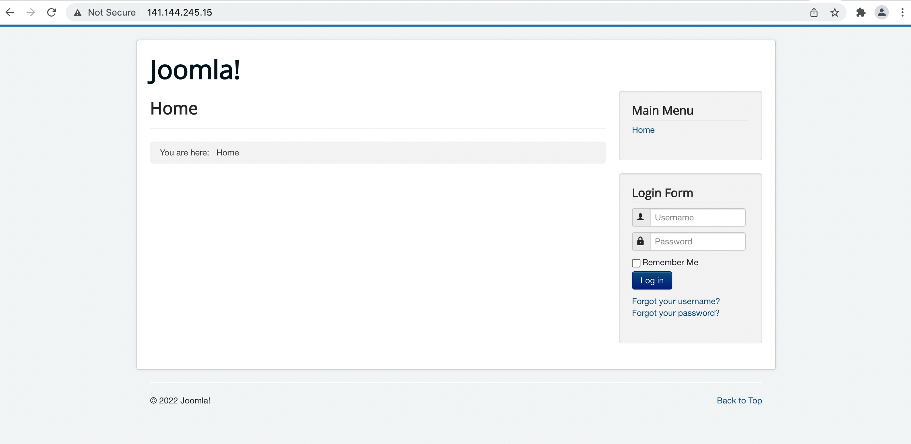
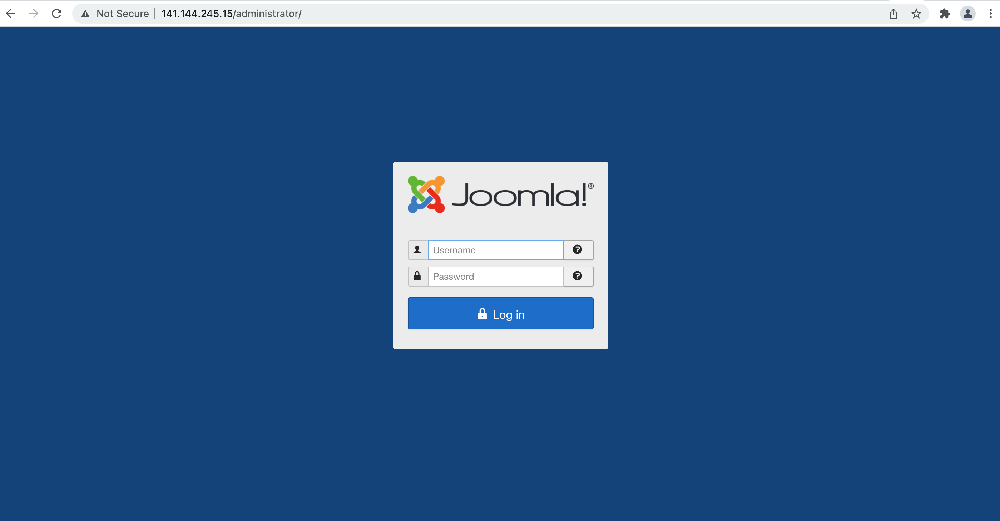
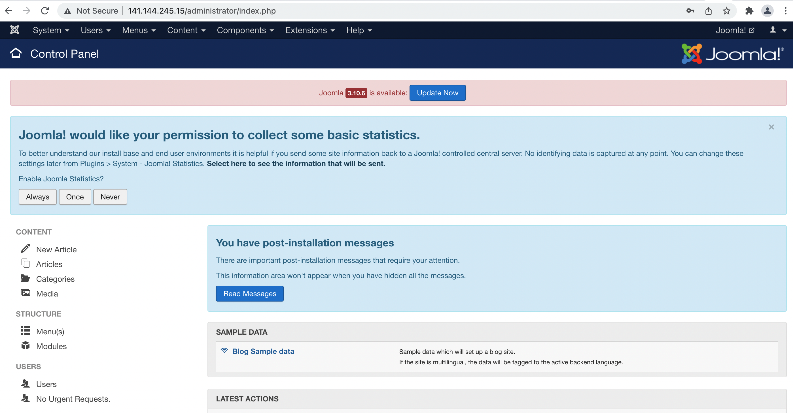

# terraform-oci-arch-joomla-mds

Deploy Joomla on Oracle Cloud Intrastructure (OCI) and MySQL Database Service (MDS) using these Terraform modules.

## Prerequisites

- Permission to `manage` the following types of resources in your Oracle Cloud Infrastructure tenancy: `vcns`, `internet-gateways`, `route-tables`, `security-lists`, `subnets`, `mysql-family`, and `instances`.

- Quota to create the following resources: 1 VCN, 2 subnets, 1 Internet Gateway, 1 NAT Gateway, 2 route rules, 1 MySQL Database System (MDS) instance, and 1 compute instance (Joomla CMS).

If you don't have the required permissions and quota, contact your tenancy administrator. See [Policy Reference](https://docs.cloud.oracle.com/en-us/iaas/Content/Identity/Reference/policyreference.htm), [Service Limits](https://docs.cloud.oracle.com/en-us/iaas/Content/General/Concepts/servicelimits.htm), [Compartment Quotas](https://docs.cloud.oracle.com/iaas/Content/General/Concepts/resourcequotas.htm).

## Deploy Using Oracle Resource Manager

1. Click [](https://cloud.oracle.com/resourcemanager/stacks/create?zipUrl=https://github.com/oracle-devrel/terraform-oci-arch-joomla-mds/releases/latest/download/terraform-oci-arch-joomla-mds-stack-latest.zip)

    If you aren't already signed in, when prompted, enter the tenancy and user credentials.

2. Review and accept the terms and conditions.

3. Select the region where you want to deploy the stack.

4. Follow the on-screen prompts and instructions to create the stack.

5. After creating the stack, click **Terraform Actions**, and select **Plan**.

6. Wait for the job to be completed, and review the plan.

    To make any changes, return to the Stack Details page, click **Edit Stack**, and make the required changes. Then, run the **Plan** action again.

7. If no further changes are necessary, return to the Stack Details page, click **Terraform Actions**, and select **Apply**. 

## Deploy Using the Terraform CLI

### Clone the Module

Now, you'll want a local copy of this repo. You can make that with the commands:

```
    git clone https://github.com/oracle-devrel/terraform-oci-arch-joomla-mds.git
    cd terraform-oci-arch-joomla-mds
    ls
```

### Prerequisites
First off, you'll need to do some pre-deploy setup.  That's all detailed [here](https://github.com/cloud-partners/oci-prerequisites).

Create a `terraform.tfvars` file, and specify the following variables:

```
# Authentication
tenancy_ocid         = "<tenancy_ocid>"
user_ocid            = "<user_ocid>"
fingerprint          = "<finger_print>"
private_key_path     = "<pem_private_key_path>"

# Region
region = "<oci_region>"

# Compartment
compartment_ocid = "<compartment_ocid>"

# MDS admin_password
admin_password = "<admin_password>"

# joomla_password
joomla_password = "<joomla_password>"

# numberOfNodes
numberOfNodes = 1 # value 2+ for multinode scenario will be deployed inluding LB & FSS.

# joomla_console_email
joomla_console_email = "user.name@example.com"

# joomla_console_password
joomla_console_password = "<joomla_console_password>"
````

### Create the Resources
Run the following commands:

    terraform init
    terraform plan
    terraform apply

### Destroy the Deployment
When you no longer need the deployment, you can run this command to destroy the resources:

    terraform destroy

## Deploy as a Module
It's possible to utilize this repository as remote module, providing the necessary inputs:

```
module "oci-arch-joomla-mds" {
  source                        = "github.com/oracle-devrel/terraform-oci-arch-joomla-mds"
  tenancy_ocid                  = "<tenancy_ocid>"
  user_ocid                     = "<user_ocid>"
  fingerprint                   = "<finger_print>"
  private_key_path              = "<private_key_path>"
  region                        = "<oci_region>"
  compartment_ocid              = "<compartment_ocid>"
  admin_password                = "<admin_password>" 
  joomla_password               = "<joomla_password>"  
  numberOfNodes                 = 1 
  joomla_console_email          = "user.name@example.com"
  joomla_console_password       = "<joomla_console_password>"
}
```

### Testing your Deployment

1. After the deployment is finished, you can access Joomla Home Page by picking joomla_home_URL output and pasting it into the web browser window:

````
joomla_home_URL = http://141.144.245.15/
`````




2. To access the Joomla Console page you need to log in after picking up Joomla console URL output:

````
joomla_console_URL = http://141.144.245.15/administrator/
`````





## Contributing
This project is open source.  Please submit your contributions by forking this repository and submitting a pull request!  Oracle appreciates any contributions that are made by the open source community.

### Attribution & Credits
This repository was initially inspired on the materials found in [lefred's blog](https://lefred.be/content/deploying-joomla-on-oci-and-mds/). One of the enhancements done to the materials in question was the adoption of the [OCI Cloudbricks MySQL module](https://github.com/oracle-devrel/terraform-oci-cloudbricks-mysql-database).
That being the case, we would sincerely like to thank:
- Frédéric Descamps (https://github.com/lefred)
- Denny Alquinta (https://github.com/dralquinta)

## License
Copyright (c) 2024 Oracle and/or its affiliates.

Licensed under the Universal Permissive License (UPL), Version 1.0.

See [LICENSE](LICENSE.txt) for more details.
